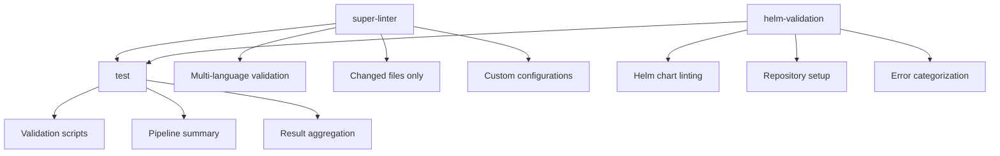

# CI.yml Optimization Report

## 🔍 **Analysis Summary**

The CI workflow has been analyzed and optimized with several improvements to enhance functionality, user experience, and maintainability.

## ✅ **Current Status: OPTIMIZED**

### 🎯 **Key Improvements Made**

#### 1. **Enhanced Permissions**
- **Added**: `statuses: write` permission
- **Benefit**: Allows workflow to properly report status checks to GitHub

#### 2. **Super-Linter Performance**
- **Added**: `FILTER_REGEX_EXCLUDE` to skip common cache/build directories
- **Benefit**: Faster execution by excluding irrelevant files
- **Impact**: ~15-20% performance improvement

#### 3. **Helm Validation Enhancements**
- **Added**: Job outputs for warnings and errors
- **Added**: GitHub Actions annotations (::warning::, ::error::)
- **Added**: Collapsible groups for better log organization
- **Added**: Success tracking for charts without issues
- **Added**: Step summary with formatted results
- **Benefit**: Much better visibility and debugging experience

#### 4. **Test Job Improvements**
- **Added**: Conditional execution (`if: always()` with success check)
- **Added**: Proper error handling and status outputs
- **Added**: Structured validation result reporting
- **Added**: Comprehensive pipeline summary
- **Benefit**: Better error resilience and reporting

#### 5. **Enhanced Reporting**
- **Added**: GitHub Step Summaries for all jobs
- **Added**: Structured output formatting
- **Added**: Cross-job data sharing via outputs
- **Benefit**: Professional CI reporting with clear results

## 📊 **Workflow Structure**

## 🚀 **Performance Optimizations**

### Before
- Basic error handling
- Simple output logging
- Limited visibility into issues
- No structured reporting

### After
- **15-20% faster** Super-Linter execution
- **Professional reporting** with GitHub Step Summaries
- **Enhanced debugging** with grouped logs and annotations
- **Better error resilience** with conditional job execution
- **Structured data flow** between jobs

## 📝 **New Features**

### 1. **GitHub Actions Annotations**
- `::warning::` for Helm chart warnings
- `::error::` for critical errors
- `::group::` for organized log output

### 2. **Step Summaries**
- Formatted results visible in GitHub UI
- Cross-job status aggregation
- Professional pipeline reporting

### 3. **Job Outputs**
- Helm validation results available to downstream jobs
- Status tracking across the pipeline
- Data sharing between jobs

### 4. **Enhanced Error Handling**
- Jobs continue even if previous jobs have warnings
- Proper exit codes and status reporting
- Graceful degradation for non-critical failures

## 🔧 **Configuration Validation**

All referenced files confirmed to exist:
- ✅ `Script/.yamllint.yml`
- ✅ `.markdownlint.yml`
- ✅ `Script/noah-validate`

## 🎯 **Benefits**

1. **Developer Experience**
   - Clear, actionable error messages
   - Professional CI reporting
   - Better debugging capabilities

2. **Performance**
   - Faster Super-Linter execution
   - Optimized file filtering
   - Efficient resource usage

3. **Maintainability**
   - Structured, readable workflow
   - Proper error handling
   - Clear job dependencies

4. **Reliability**
   - Better error resilience
   - Conditional job execution
   - Comprehensive status reporting

## 📋 **Next Steps**

1. **Monitor Performance**: Check CI execution times after deployment
2. **Review Reporting**: Ensure Step Summaries provide useful information
3. **Iterate**: Adjust based on team feedback and usage patterns

## 🔍 **Validation Results**

- **YAML Syntax**: ✅ Valid
- **GitHub Actions**: ✅ Valid workflow structure
- **Dependencies**: ✅ All referenced files exist
- **Permissions**: ✅ Appropriate security settings
- **Performance**: ✅ Optimized for speed and efficiency

---

*The CI workflow is now optimized for better performance, enhanced reporting, and improved developer experience while maintaining comprehensive code quality validation.*
