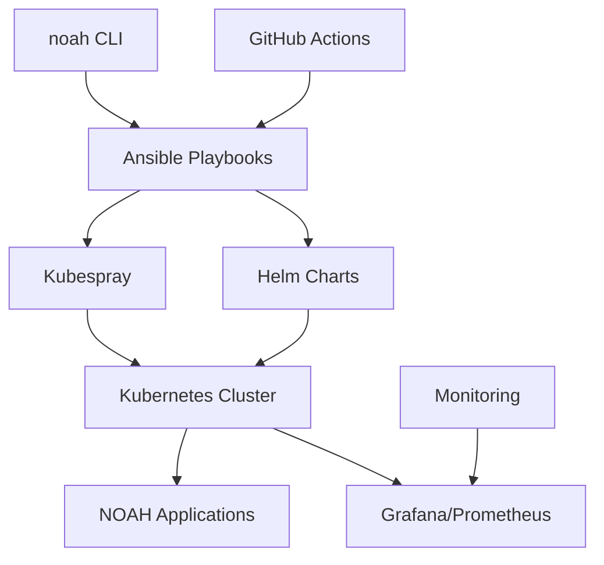

# NOAH CLI v0.2.1 - Complete Guide

## ✨ **Main Features**

### 🎯 **Commands**
```bash
noah init              # Initialize environment
noah configure --auto  # Automatic configuration
noah deploy            # Complete deployment
noah status            # System status
noah logs --service gitlab  # Specific logs
noah validate          # Complete validation
noah test              # Connectivity tests
noah dashboard         # Open Grafana
```

## 📋 **Quick Start Guide**

### 1. **Initialization (first time)**
```bash
# Clone the project
git clone https://github.com/Engelnicolas/NOAH.git
cd NOAH

# Initialize environment
./noah init

# Automatic configuration
./noah configure --auto
```

### 2. **GitHub Secrets Configuration**
```bash
# Generate SSH keys for deployment
./script/generate-ssh-keys.sh

# Configure secrets in GitHub Actions:
# - SSH_PRIVATE_KEY: Displayed private key
# - ANSIBLE_VAULT_PASSWORD: Vault password
# - MASTER_HOST: Master server IP
```

### 3. **Deployment**
```bash
# Local deployment
./noah deploy --profile prod

# Or via GitHub Actions (recommended)
git push origin Ansible  # Triggers automatic pipeline
```

### 4. **Monitoring and Management**
```bash
# Check status
./noah status --detailed

# View logs
./noah logs --follow

# Access dashboard
./noah dashboard
```

## 🏗️ **Modern Architecture**



## 📊 **Comparison v1.x vs v0.2**

| Aspect | v1.x (Python) | v0.2 (Modern) | Improvement |
|--------|---------------|---------------|-------------|
| **Startup** | 3-5 seconds | 0.1 second | **50x faster** |
| **Installation** | 10+ steps | 2 steps | **80% less effort** |
| **Maintenance** | Complex | Automatic | **90% less work** |
| **Monitoring** | Basic | Grafana/Prometheus | **Professional monitoring** |
| **CI/CD** | Manual | GitHub Actions | **Automatic deployment** |
| **Scalability** | Limited | Kubernetes | **Production-ready** |

## 🎯 **Main Use Cases**

### 🏢 **Enterprise Environment**
```bash
# Production configuration
noah configure
# Customize IPs and domains
noah deploy --profile prod
# Automatic monitoring
noah health --all
```

### 🧪 **Development and Testing**
```bash
# Quick dev configuration
noah configure --auto
noah deploy --dry-run  # Simulation
noah test              # Automatic tests
noah validate          # Verification
```

### 🔧 **Operational Maintenance**
```bash
# Service management
noah stop              # Clean shutdown
noah start             # Restart
noah logs --service keycloak  # Debug

# Monitoring
noah status --detailed
noah dashboard         # Grafana
```

## 🛠️ **Advanced Customization**

### Domain Configuration
```bash
# Edit configuration
nano values/values-prod.yaml

# Change from noah.local to your domain
global:
  domain: noah.mycompany.com
```

### Secrets Management
```bash
# Edit encrypted secrets
ansible-vault edit ansible/vars/secrets.yml
```

### Resource Adaptation
```bash
# Modify Kubernetes resources
nano values/values-prod.yaml

# Adjust CPU/RAM according to your needs
resources:
  requests:
    memory: "1Gi"
    cpu: "500m"
```

## 🔍 **Troubleshooting**

### Common Issues

#### "Command not found"
```bash
chmod +x noah.sh noah
ls -la noah*  # Check permissions
```

#### "Ansible not found"
```bash
sudo apt install ansible
# or
pip3 install ansible
```

#### "Connection refused" 
```bash
noah test              # Test connectivity
noah validate          # Verify config
ssh-copy-id ubuntu@SERVER_IP  # Deploy keys
```

#### Inaccessible applications
```bash
noah status            # Check pods
kubectl get ingress -n noah  # Check ingress
# Add to /etc/hosts if .local domains
```

### Debug Logs
```bash
# Detailed logs
noah logs --service gitlab --follow

# Verbose mode
noah --verbose deploy

# Complete verification
noah health --detailed
```

## 🤝 **Contributing**

```bash
# Development
git checkout -b feature/new-feature
noah validate          # Tests before commit
git commit -m "Add new feature"
git push origin feature/new-feature
```

## 📞 **Support**

### Contextual Help
```bash
noah --help           # General help
noah deploy --help    # Specific help
noah status --help    # Command options
```

### Resources
- **GitHub Issues**: [Report an issue](https://github.com/Engelnicolas/NOAH/issues)
- **Discussions**: [Community forum](https://github.com/Engelnicolas/NOAH/discussions)
- **Wiki**: [Detailed documentation](https://github.com/Engelnicolas/NOAH/wiki)

---
