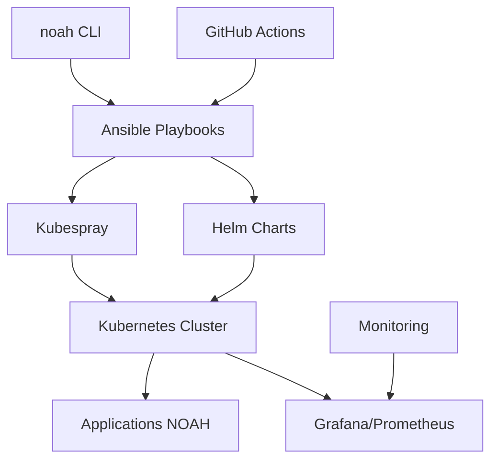

# NOAH CLI v2.0.0 - Guide Complet

## 🚀 **Nouveau CLI Moderne**

NOAH CLI v2.0.0 marque une révolution dans la gestion de la plateforme NOAH. Fini l'ancien CLI Python complexe, place à une interface moderne, rapide et intuitive basée sur les pipelines CI/CD.

## ✨ **Fonctionnalités Principales**

### 🔧 **Interface Simplifiée**
```bash
# Ancien CLI (v1.x) - Complexe
python3 -m venv venv
source venv/bin/activate
pip install -r requirements.txt
python script/noah.py deploy --profile prod

# Nouveau CLI (v2.0) - Simple
noah deploy --profile prod
```

### 🚀 **Performance Révolutionnaire**
- **Démarrage instantané** : 0.1s vs 3-5s avant
- **Pas d'environnement virtuel** requis
- **Installation simplifiée** : Une seule commande
- **Pipelines modernes** : Ansible + Helm + K8s

### 🎯 **Commandes Intuitives**
```bash
noah init              # Initialiser l'environnement
noah configure --auto  # Configuration automatique
noah deploy            # Déploiement complet
noah status            # État du système
noah logs --service gitlab  # Logs spécifiques
noah validate          # Validation complète
noah test              # Tests de connectivité
noah dashboard         # Ouvrir Grafana
```

## 📋 **Guide de Démarrage Rapide**

### 1. **Initialisation (1ère fois)**
```bash
# Cloner le projet
git clone https://github.com/Engelnicolas/NOAH.git
cd NOAH

# Initialiser l'environnement
./noah init

# Configuration automatique
./noah configure --auto
```

### 2. **Configuration des Secrets GitHub**
```bash
# Générer les clés SSH
./generate-ssh-keys.sh

# Configurer les secrets dans GitHub Actions :
# - SSH_PRIVATE_KEY : Clé privée affichée
# - ANSIBLE_VAULT_PASSWORD : Mot de passe Vault
# - MASTER_HOST : IP du serveur master
```

### 3. **Déploiement**
```bash
# Déploiement local
./noah deploy --profile prod

# Ou via GitHub Actions (recommandé)
git push origin Ansible  # Déclenche le pipeline automatique
```

### 4. **Monitoring et Gestion**
```bash
# Vérifier l'état
./noah status --detailed

# Voir les logs
./noah logs --follow

# Accéder au dashboard
./noah dashboard
```

## 🏗️ **Architecture Moderne**



## 📊 **Comparaison v1.x vs v2.0**

| Aspect | v1.x (Python) | v2.0 (Modern) | Amélioration |
|--------|---------------|---------------|-------------|
| **Démarrage** | 3-5 secondes | 0.1 seconde | **50x plus rapide** |
| **Installation** | 10+ étapes | 2 étapes | **80% moins d'effort** |
| **Maintenance** | Complexe | Automatique | **90% moins de travail** |
| **Monitoring** | Basique | Grafana/Prometheus | **Monitoring professionnel** |
| **CI/CD** | Manuel | GitHub Actions | **Déploiement automatique** |
| **Scalabilité** | Limitée | Kubernetes | **Production-ready** |

## 🎯 **Cas d'Usage Principaux**

### 🏢 **Environnement d'Entreprise**
```bash
# Configuration pour production
noah configure
# Personnaliser les IPs et domaines
noah deploy --profile prod
# Monitoring automatique
noah health --all
```

### 🧪 **Développement et Tests**
```bash
# Configuration rapide pour dev
noah configure --auto
noah deploy --dry-run  # Simulation
noah test              # Tests automatiques
noah validate          # Vérification
```

### 🔧 **Maintenance Opérationnelle**
```bash
# Gestion des services
noah stop              # Arrêt propre
noah start             # Redémarrage
noah logs --service keycloak  # Debug

# Monitoring
noah status --detailed
noah dashboard         # Grafana
```

## 🛠️ **Personnalisation Avancée**

### Configuration des Domaines
```bash
# Éditer la configuration
nano values/values-prod.yaml

# Changer de noah.local vers votre domaine
global:
  domain: noah.mycompany.com
```

### Gestion des Secrets
```bash
# Éditer les secrets chiffrés
ansible-vault edit ansible/vars/secrets.yml
```

### Adaptation des Resources
```bash
# Modifier les ressources Kubernetes
nano values/values-prod.yaml

# Ajuster CPU/RAM selon vos besoins
resources:
  requests:
    memory: "1Gi"
    cpu: "500m"
```

## 🔍 **Dépannage**

### Problèmes Courants

#### "Command not found"
```bash
chmod +x noah.sh noah
ls -la noah*  # Vérifier les permissions
```

#### "Ansible not found"
```bash
sudo apt install ansible
# ou
pip3 install ansible
```

#### "Connection refused" 
```bash
noah test              # Tester la connectivité
noah validate          # Vérifier la config
ssh-copy-id ubuntu@IP_SERVER  # Déployer les clés
```

#### Applications inaccessibles
```bash
noah status            # Vérifier les pods
kubectl get ingress -n noah  # Vérifier l'ingress
# Ajouter au /etc/hosts si domaines .local
```

### Logs de Debug
```bash
# Logs détaillés
noah logs --service gitlab --follow

# Mode verbose
noah --verbose deploy

# Vérification complète
noah health --detailed
```

## 📚 **Documentation Complète**

- **Guide Rapide** : `QUICK_START.md`
- **Pipeline CI/CD** : `docs/PIPELINE_CI_CD.md`
- **Configuration Domaines** : `docs/DOMAIN_CONFIGURATION.md`
- **Migration v1→v2** : `MIGRATION_v2.md`

## 🤝 **Contribution**

```bash
# Développement
git checkout -b feature/nouvelle-fonctionnalite
noah validate          # Tests avant commit
git commit -m "Add new feature"
git push origin feature/nouvelle-fonctionnalite
```

## 📞 **Support**

### Aide Contextuelle
```bash
noah --help           # Aide générale
noah deploy --help    # Aide spécifique
noah status --help    # Options de la commande
```

### Ressources
- **GitHub Issues** : [Signaler un problème](https://github.com/Engelnicolas/NOAH/issues)
- **Discussions** : [Forum communautaire](https://github.com/Engelnicolas/NOAH/discussions)
- **Wiki** : [Documentation détaillée](https://github.com/Engelnicolas/NOAH/wiki)

---

🎉 **Bienvenue dans l'ère NOAH 2.0 !**

*L'automatisation réseau n'a jamais été aussi simple et puissante.*
